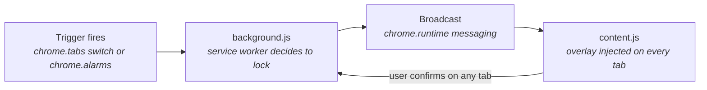

# 🛑 FocusCapsule

**A Chrome extension that stops impulsive tab-switching and locks your whole browser into focus — until you consciously confirm you're ready to move on.**

Built for [Hackathon Name] — a lightweight Manifest V3 prototype exploring behavioral nudges for digital focus.

---

## The Problem

A message pings on WhatsApp. You open it to send one quick reply. "Just checking" turns into a reflexive jump to Gmail. Twenty tabs later, the task you were actually doing is forgotten — and 45 minutes of focus time is gone.

FocusCapsule interrupts that reflex loop at the exact moment it happens.

## How It Works

1. **Trigger fires** — either you switch into Gmail (especially right after WhatsApp), or a checkpoint time you scheduled earlier in the day arrives.
2. **`background.js` decides to lock** — the service worker detects the trigger and starts a shared focus-lock session.
3. **Broadcast** — a lock message is sent to *every* open tab via `chrome.runtime` messaging, including any new tab opened while the lock is active.
4. **`content.js` shows the overlay** — a full-screen capsule card appears on every tab, asking you to actively confirm before continuing (a checkbox, not a passive countdown).
5. **Confirm once, unlock everywhere** — checking the box and clicking "Continue" on *any* tab releases the lock across all of them at once.



## Features

- 🔗 **Gmail trigger** — detects switching into Gmail (`mail.google.com`), especially right after WhatsApp Web
- 🔒 **Browser-wide lock** — every open tab pauses together, including tabs opened mid-lock — no loopholes
- ✅ **Active confirmation** — a conscious checkbox replaces a passive countdown timer; you decide when you're ready
- ⏰ **Scheduled checkpoints** — use the popup to pre-plan focus blocks for your day; `chrome.alarms` triggers the same lock automatically, and repeats daily
- 🎨 **Custom overlay UI** — a distraction-blocking full-screen card, not just a browser alert

## Installation (Local / Unpacked)

This is a hackathon prototype and isn't published to the Chrome Web Store yet. To run it locally:

1. Clone or download this repository.
2. Open Chrome and go to `chrome://extensions`.
3. Turn on **Developer mode** (toggle, top-right).
4. Click **Load unpacked** and select the project folder.
5. Pin the extension icon (puzzle-piece icon in the toolbar → pin FocusCapsule).

## Usage

- **WhatsApp → Gmail block**: just browse normally. Switching into Gmail automatically locks every open tab until you confirm.
- **Scheduled checkpoints**: click the FocusCapsule icon in the toolbar, add a task name and a time, and hit "Add checkpoint." At that time each day, the same lock fires across your browser.

## Tech Stack

| Piece | Purpose |
|---|---|
| **Manifest V3** | Extension architecture (service worker, no persistent background page) |
| `chrome.tabs` | Detects tab switches and Gmail navigation |
| `chrome.alarms` | Fires scheduled checkpoints reliably, even if the service worker was idle |
| `chrome.storage.local` | Persists the user's scheduled tasks |
| `chrome.runtime` messaging | Broadcasts lock/unlock events between `background.js` and every `content.js` instance |
| Vanilla JS + CSS | No frameworks — overlay and popup UI are hand-built for a small footprint |

## Project Structure

```
FocusCapsule/
├── manifest.json     # Manifest V3 config — permissions, background worker, content script, popup
├── background.js     # Service worker — detects triggers, manages the shared lock, schedules alarms
├── content.js         # Injected into every tab — renders the block overlay, handles confirmation
├── popup.html         # UI for adding/removing scheduled focus checkpoints
├── popup.js           # Popup logic — reads/writes chrome.storage.local, notifies background.js
└── README.md
```

## Roadmap

- [ ] Publish to the Chrome Web Store
- [ ] More triggers — Instagram, X, YouTube
- [ ] Weekly focus analytics dashboard
- [ ] Cross-browser support (Edge, Firefox)
- [ ] Editable / one-off (non-repeating) checkpoints

## Known Limitations

- There's a brief flash of a new tab's real content before the overlay lands, since the extension waits for the page to finish loading before injecting — a fully instant block would need to intercept navigation itself (e.g. `declarativeNetRequest`).
- Gmail detection matches `mail.google.com` specifically, not all of `google.com`.

---

Built as a hackathon prototype. Feedback and PRs welcome.
